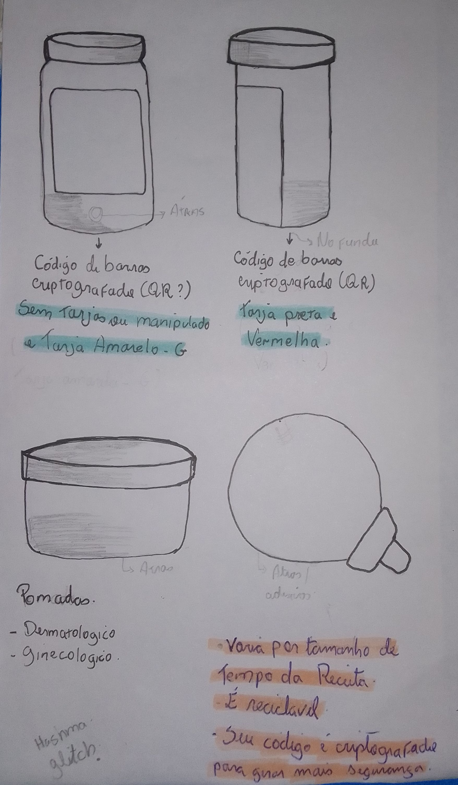

# Saúde Única | Health-Unit

<h3>Sobre</h3>

Site para mostrar os pedidos e resultados de exames, receitas médicas e histórico de consultas, é como se fosse uma pasta de documentos de saúde, mas irá servir como se fosse Unidade Básica de Saúde Municipal e Hospitalar. O perfil irá desmonstrar <i>citado abaixo</i>

<li>Histórico de Consultas e Exames</li>
<li>Vacinas Humanas</li>
<li>Remédios (O Uso)</li>
<li>Receitas Médicas</li>
<li>Pedidos e Solicitações</li>
<li>Pesquisa de Satisfação atráves da secretaria da saúde</li>

<h4>Desenvolvimento</h4>

No site haverá algumas perguntas, mas ALGUNS não são obrigatórias responder, a caixa de perguntas terá duas cores que serão:

Verde, que são perguntas obrigatórias para responder

Vermelho, que são perguntas não obrigatórias e opcionais

As perguntas são sobre:
  <li>Seu estado de saúde</li>
  <li>Remédios</li>
  <li>Vacinas</li>

<h5>Solicitações</h5>

Você pode fazer a solicitação no formulário.

Você pode solicitar seu exame, marcar sua consulta atráves do formulário da secretaria.

Você pode solicitar alguns remédios e algum objeto hospitalar (como luvas, gaze, soro, faixa/atadura... Mas objetos como seringas, remédios tarjas* são restritos que tem que ser justificados).

Nós também vamos ter parceria com clinícas veterinárias e especialistas para solicitações de remédios para seu animal de estimação

<h5>Desenhos</h5>
  

Você poderá ver as imagens anteriores, na pasta public/imgs. E o último desenho é uma pomada

<a href="HealthUnit.drawio">...<a>

:warning:
Comentário: 
Isso é apenas uma pequena demonstração de como seria os frascos. Sei que o desenho ficou estranho, mas irei fazer update em breve

Não irei colocar o banco de dados

